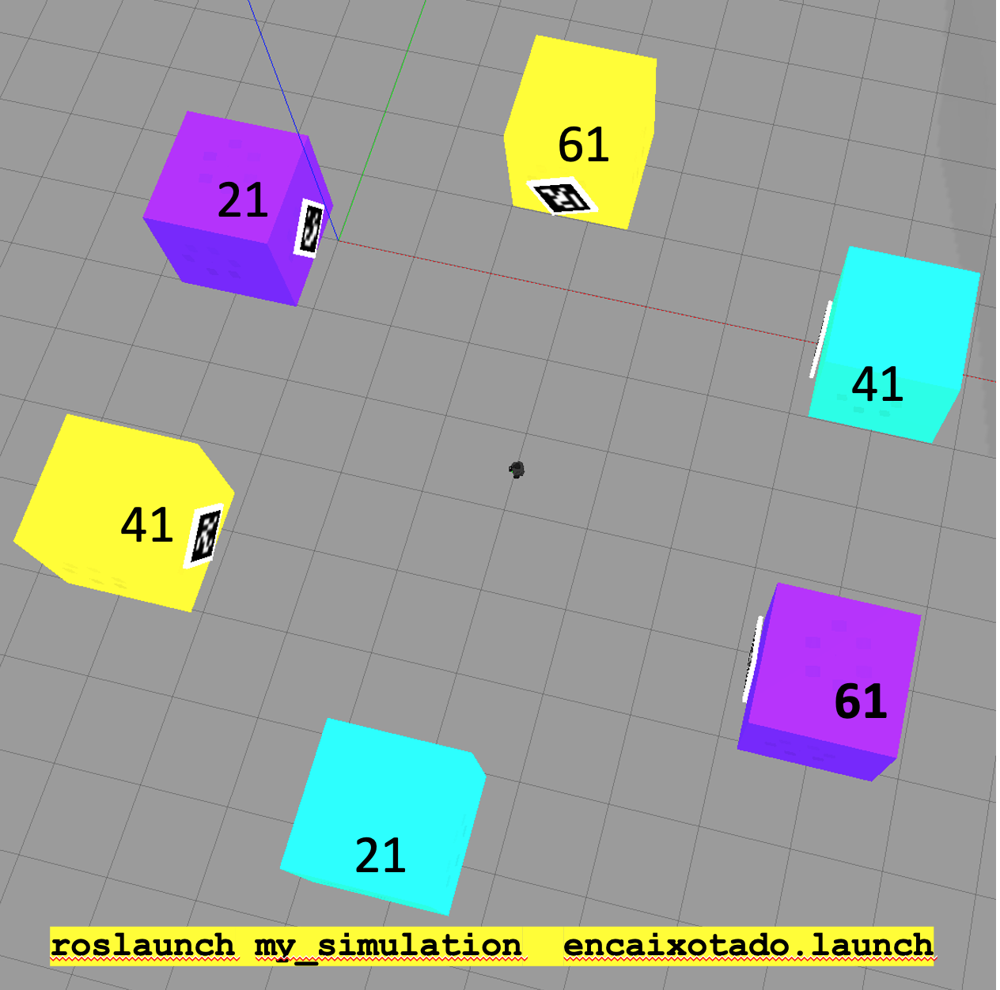
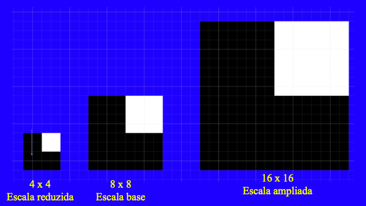
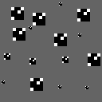
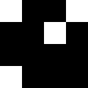
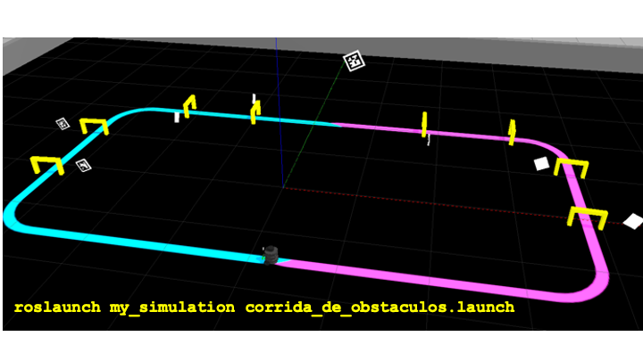

# Robótica Computacional 2021.1

[Mais orientações no README](./README.md)

## Prova P2 AF opção 2 de horário

**Você deve escolher somente 2 questões para fazer.**


Nome:_______________


Questões que fez:____________


Observações de avaliações nesta disciplina:

* Não fique em um canal/mesa do Teams. Trabalhe sozinho
* Inicie a prova no Blackboard para a ferramenta de Proctoring iniciar. Só finalize o Blackboard quando enviar a prova via Github classroom
* Só é necessário enviar a prova via Github Classroom uma vez
* Caso haja alguma falha ou queda de conexão avise ao professor e reabra o Proctoring. 
* Durante esta prova vamos registrar via Proctoring somente a tela, não a câmera nem microfone
* Ponha o nome no enunciado da prova
* Tenha os repositórios https://github.com/Insper/robot21.1/ ,  https://github.com/arnaldojr/my_simulation e https://github.com/arnaldojr/mybot_description.git  atualizados em seu `catkin_ws/src` .
* Você pode consultar a internet ou qualquer material, mas não pode se comunicar com pessoas ou colegas a respeito da prova
* Todos os códigos fornecidos estão executando perfeitamente. Foram testados no SSD da disciplina na versão 2021.1
* Teste sempre seu código enquanto desenvolver
* Entregue código que executa
* Faça commits e pushes frequentes no seu repositório (tem dicas [no final deste arquivo](./inst
rucoes_setup.md))
* Esteja com o Teams aberto e pronto para receber calls do professor e da equipe. 
* Avisos importantes serão dados no chat da prova no Teams, será feito o tag para a equipe toda para que você não precise ficar na ligação
* Permite-se consultar qualquer material online ou próprio. Não se pode compartilhar informações com colegas durante a prova
* A responsabilidade por ter o *setup* funcionando é de cada estudante
* Questões de esclarecimento geral podem ser perguntadas no chat do Teams
* Se você estiver em casa pode fazer pausas e falar com seus familiares, mas não pode receber ajuda na prova.
* É proibido colaborar ou pedir ajuda a colegas ou qualquer pessoa que conheça os assuntos avaliados nesta prova.
* Os exercícios admitem diversas estratégias de resolução. A prova de cada aluno é única

Existe algumas dicas de referência rápida de setup [instrucoes_setup.md](instrucoes_setup.md)

**Integridade Intelectual**

Se você tiver alguma evidência de cola ou fraude cometida nesta prova, [use este serviço de e-mail anônimo](https://www.guerrillamail.com/pt/compose)  para informar ao professor.  Ou [este formulário](https://forms.gle/JPhqjPmuKAHxmvwZ9)


## Tabela para questões 1 e 3

Verifique neste link quais objetos deve conseguir [https://alinsperedu-my.sharepoint.com/:x:/g/personal/fabio_miranda_al_insper_edu_br/ESdAsClU06dHsqX7b-a_DOsBLQvWHSvSSRznrE7YoLvnng?e=fE88ia](https://alinsperedu-my.sharepoint.com/:x:/g/personal/fabio_miranda_al_insper_edu_br/ESdAsClU06dHsqX7b-a_DOsBLQvWHSvSSRznrE7YoLvnng?e=fE88ia)


## Planilha de dúvidas

Avise aqui se tiver problemas e ligamos para você. *Não* vamos dar manutenção básica nem explicar teoria hoje.   [https://docs.google.com/spreadsheets/d/13smFYtV2zI6kDAgRCNTJkAR-EWRTsTvKK0aTxoa31BE/edit?usp=sharing](https://docs.google.com/spreadsheets/d/13smFYtV2zI6kDAgRCNTJkAR-EWRTsTvKK0aTxoa31BE/edit?usp=sharing)

## Aviso para questões de ROS

**Atenção: ** 

Para fazer estra questão você precisa ter o `my_simulation` e o `mybot_description` atualizado.

    cd ~/catkin_ws/src
    cd my_simulation
    git stash
    git pull

Ou então se ainda não tiver:

    cd ~/catkin_ws/src
    git clone https://github.com/arnaldojr/my_simulation.git

Para o mybot_description:

    cd ~/catkin_ws/src
    cd mybot_description
    git stash
    git pull

Ou então se ainda não tiver:

    cd ~/catkin_ws/src
    git clone https://github.com/arnaldojr/mybot_description


Em seguida faça o [catkin_make](./instrucoes_setup.md). 

## Questão 1 (5.00 pontos)

</img>


Seu robô está no cenário visível abaixo:


    roslaunch my_simulation encaixotado.launch


#### O que é para fazer

Inicialmente fazer o robô sortear sempre um ângulo aleatório e fazer um giro correspondendo a este ângulo. 

**Depois** o robô vai precisar procurar as 2 caixas objetivo. Depois de localizar cada uma precisa haver uma mensagem clara no terminal de que encontrou e esperar 5 segundos com a caixa no campo de visão antes de prosseguir para a outra.

**Exemplo de objetivo:**

41 ciano depois 21 roxo.

Neste caso o robô vai:

* dar um giro aleatório
* depois procurar a caixa ciano que tem o aruco 41
* depois de encontrar a caixa acima, dar uma mensagem e ficar com ela na visão por 5 segundos
* depois procurar a caixa roxa que tem id 21 
* depois de encontrar a última caixa, dar uma mensagem e ficar com ela na visão por 5s

Talvez você ache o exemplo `util_aruco.py` que há na pasta scripts interessante.


#### Detalhes de como rodar


O código para este exercício está em: `p2_21/scripts/Q1.py`


Depois:

    rosrun p2_21 Q1.py


|Resultado| Conceito| 
|---|---|
| Não executa | 0 |
| Sorteou o valor e deu giro aleatório | 0.5 | 
| Procura a 1.a caixa da cor certa e centraliza nela | 1.2|
| Centraliza corretamente na 1.a caixa levando em conta o id aruco certo | 2.5 |
| Localiza a 2.a caixa levando em conta a cor certa | 3.5 |
| Localiza a 2.a caixa levando em conta a cor e o id certos | 5.0 |


O giro aleatório pode ser em malha aberta (não precisa controlar por odometria)

Casos intermediários ou omissos da rubrica serão decididos pelo professor.


## Questão 2  (3.33 pontos)


Você precisa desenvolver um programa que procura em uma imagem grande sub imagens de interesse de tamanho 8x8 pixels em seu tamanho original, e também ampliadas para 16x16 ou reduzidas para 4x4. 

A imagem abaixo mostra como uma mesma imagem 8x8 pode ser ampliada para ocupar 16 x 16 pixels ou reduzida para 4 x 4. 

Considere que as imagens 8x8 usadas não terão perda ao reduzir para 4x4, assim como na figura.



**O que você deve fazer**

A partir de uma imagem grande e da imagem 8x8 de interesse: 
* Procurar todas as coordenadas linha x coluna `i,j` em que se iniciam aquelas imagens em escala original 
* Procurar também a versão reduzida para 4 x 4
* Procurar também a versão ampliada para 16 x 16

Você deve armazenar cada para `i,j` encontrado como tupla em uma lista.  E dep os resultados correspondentes a cada resolução  num dicionário com as chaves 4, 8 e 16.  O exemplo deixará mais claro: 

**Exemplo**

Para a imagem grande, podemos procurar `q2/p2b_exemplo.png` a sub imagem `q2/p2b_exemplo_mini_8_8.png`


Imagem grande:




Imagem 8x8 a procurar:




Vemos que dentro da imagem grande, o padrão 8x8 de busca aparece nas resoluções 4x4, 16x16 e 8x8. Portanto seu código deveria retornar o dicionário:

```python
{16: [(9, 14), (16, 9), (11, 1), (3, 16), (10, 4), (3, 14), (2, 6)],
 4: [(3, 10), (1, 4), (10, 2), (5, 2), (11, 9), (12, 11)],
 8: [(3, 5), (9, 5), (7, 14)]}
```

A posição que vai para a lista é a posição **dentro da imagem grande** em que a imagem pequena aparece.

A chave 4 indexa no dicionário a lista de posições `i,j`em que o padrão fornecido aparece reduzido. 
Lembramos que o que conta como posição inicial é o canto superior esquerdo das imagens.

Você pode usar este exemplo para testar seu código.   O programa invoca ainda 3 outras imagens de testes.

**Você deve programar na função procurar** que recebe a imagem grande e o padrão 8x8 e devolve o dicionário com as listas


#### Orientações

Trabalhe no arquivo `q2/q2.py`. Este exercício **não precisa** de ROS. Portanto pode ser feito até em Mac ou Windows


|Resultado| Conceito| 
|---|---|
| Não executa | zero |
|Devolve dicionário com lista com posições i j das imagens 8x8 | 2.5|
|Além do acima, lista com posições i j das imagens 4x4 | 3.75|
|Além do acima, lista com posições i j das imagens 16x16 | 5.00 | 

## Questão 3 (5.00 pontos)

</img>


Seu robô está no cenário visível abaixo:


    roslaunch my_simulation corrida_de_obstaculos.launch


#### O que é para fazer

Sortear um ângulo entre 0 e 360 graus 

Fazer o robô dar um giro correspondente ao ângulo em malha aberta

De acordo com a cor de sua pista na planilha (veja acima) o robô deve começar a seguir a pista.

O robô precisa detectar **de alguma forma** que passou por baixo de um portal amarelo. Depois de passar por cada portal o robô deve levantar a garra e jogar o portal para trás.

Sobre a deteção: 
* Você pode usar lasers
* Aruco
* Ou qualquer outro mecanismo


**Execute o controlador do braço com mybot control**

Talvez você ache [este exemplo de montar um "mapa" com o laser útil](https://github.com/mirwox/prova1_2020/blob/solution/gabarito.md)

#### Detalhes de como rodar


O código para este exercício está em: `p2_21/scripts/Q3.py`

Para rodar, recomendamos que faça:

    roslaunch my_simulation corrida_de_obstaculos.launch

Depois:

    rosrun p2_21 Q3.py


|Resultado| Conceito| 
|---|---|
| Não executa | 0 |
| Faz o robo dar um giro aleatório | 0.5 |
| Localiza a pista da cor pretendida segmentando direito | 1.0 |
| Faz o robô seguir a pista correta | 2.5 |
| Detecta de alguma forma que passo embaixo dos portais dando output visível | 3.75 |
| Consegue terminar a parte da pista de sua cor derrubando todos os portais | 5.0 |


