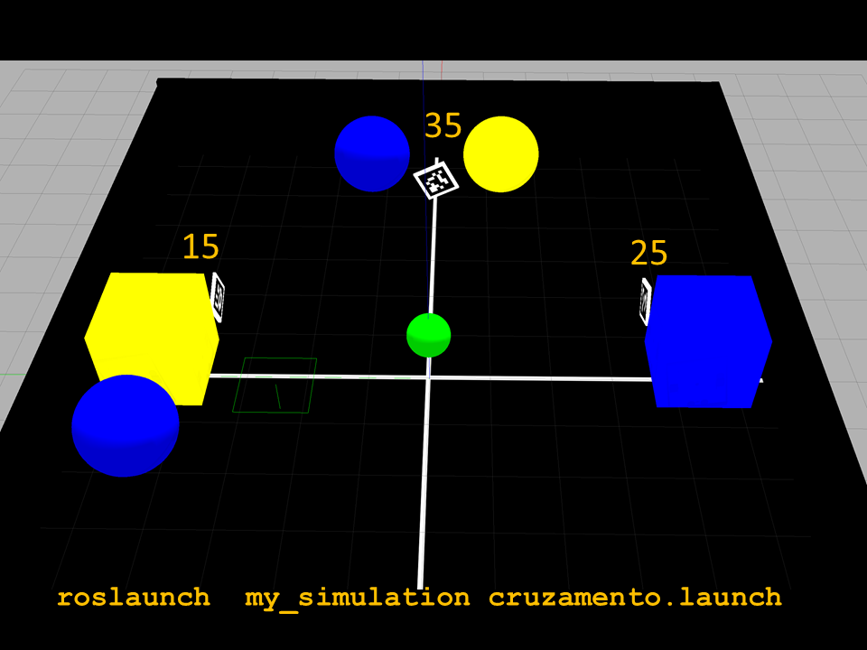
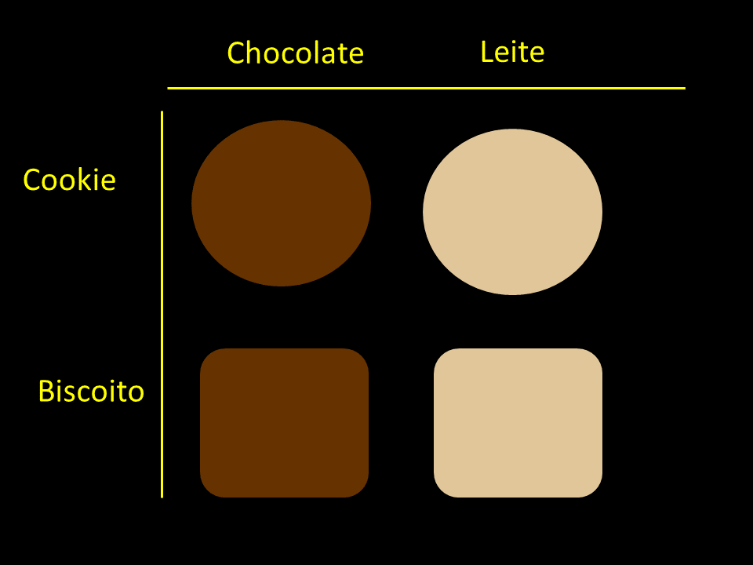
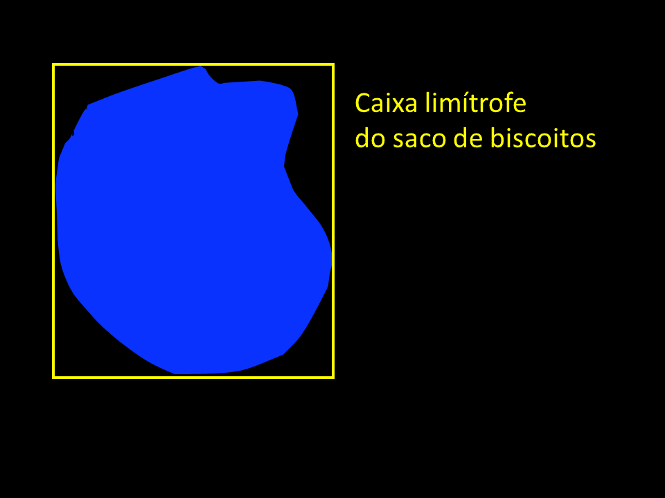
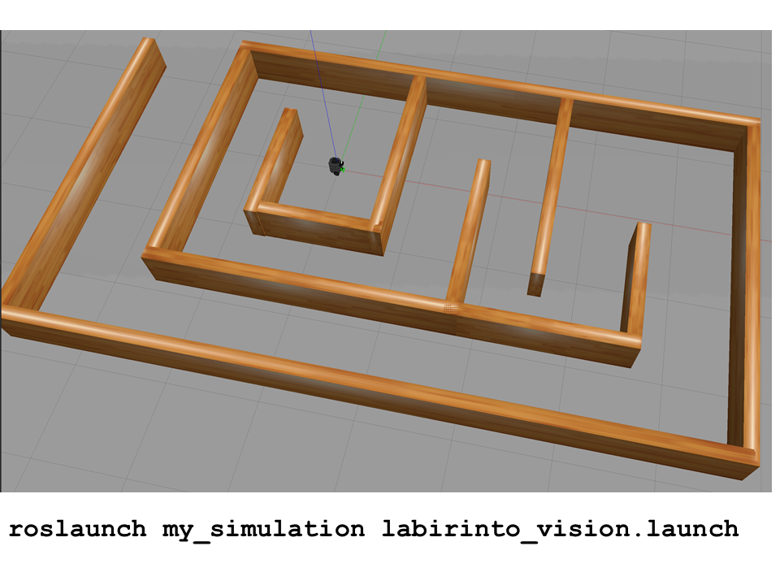

# Robótica Computacional 2021.1

[Mais orientações no README](./README.md)

## Prova SUB

**Você deve escolher somente 2 questões para fazer.**

Nome:_______________

Questões que fez:____________

Observações de avaliações nesta disciplina:

* Não fique em um canal/mesa do Teams. Trabalhe sozinho
* Inicie a prova no Blackboard para a ferramenta de Proctoring iniciar. Só finalize o Blackboard quando enviar a prova via Github classroom
* Só é necessário enviar a prova via Github Classroom uma vez
* Caso haja alguma falha ou queda de conexão avise ao professor e reabra o Proctoring. 
* Durante esta prova vamos registrar via Proctoring somente a tela, não a câmera nem microfone
* Ponha o nome no enunciado da prova
* Tenha os repositórios https://github.com/Insper/robot21.1/ ,  https://github.com/arnaldojr/my_simulation e https://github.com/arnaldojr/mybot_description.git  atualizados em seu `catkin_ws/src` .
* Você pode consultar a internet ou qualquer material, mas não pode se comunicar com pessoas ou colegas a respeito da prova
* Todos os códigos fornecidos estão executando perfeitamente. Foram testados no SSD da disciplina na versão 2021.1
* Teste sempre seu código enquanto desenvolver
* Entregue código que executa
* Faça commits e pushes frequentes no seu repositório (tem dicas [no final deste arquivo](./inst
rucoes_setup.md))
* Esteja com o Teams aberto e pronto para receber calls do professor e da equipe. 
* Avisos importantes serão dados no chat da prova no Teams, será feito o tag para a equipe toda para que você não precise ficar na ligação
* Permite-se consultar qualquer material online ou próprio. Não se pode compartilhar informações com colegas durante a prova
* A responsabilidade por ter o *setup* funcionando é de cada estudante
* Questões de esclarecimento geral podem ser perguntadas no chat do Teams
* Se você estiver em casa pode fazer pausas e falar com seus familiares, mas não pode receber ajuda na prova.
* É proibido colaborar ou pedir ajuda a colegas ou qualquer pessoa que conheça os assuntos avaliados nesta prova.
* Os exercícios admitem diversas estratégias de resolução. A prova de cada aluno é única

Existe algumas dicas de referência rápida de setup [instrucoes_setup.md](instrucoes_setup.md)

**Integridade Intelectual**

Se você tiver alguma evidência de cola ou fraude cometida nesta prova, [use este serviço de e-mail anônimo](https://www.guerrillamail.com/pt/compose)  para informar ao professor.  Ou [este formulário](https://forms.gle/JPhqjPmuKAHxmvwZ9)

## Tabela para Questão 1

Verifique neste link quais objetos deve conseguir [https://alinsperedu-my.sharepoint.com/:x:/g/personal/fabio_miranda_al_insper_edu_br/ESdAsClU06dHsqX7b-a_DOsBLQvWHSvSSRznrE7YoLvnng?e=fE88ia](https://alinsperedu-my.sharepoint.com/:x:/g/personal/fabio_miranda_al_insper_edu_br/ESdAsClU06dHsqX7b-a_DOsBLQvWHSvSSRznrE7YoLvnng?e=fE88ia)

## Planilha de dúvidas

Avise aqui se tiver problemas e ligamos para você. *Não* vamos dar manutenção básica nem explicar teoria hoje.   [https://docs.google.com/spreadsheets/d/13smFYtV2zI6kDAgRCNTJkAR-EWRTsTvKK0aTxoa31BE/edit?usp=sharing](https://docs.google.com/spreadsheets/d/13smFYtV2zI6kDAgRCNTJkAR-EWRTsTvKK0aTxoa31BE/edit?usp=sharing)

## Aviso para questões de ROS

**Atenção: ** 

Para fazer estra questão você precisa ter o `my_simulation` e o `mybot_description` atualizado.

    cd ~/catkin_ws/src
    cd my_simulation
    git stash
    git pull

Ou então se ainda não tiver:

    cd ~/catkin_ws/src
    git clone https://github.com/arnaldojr/my_simulation.git

Para o mybot_description:

    cd ~/catkin_ws/src
    cd mybot_description
    git stash
    git pull

Ou então se ainda não tiver:

    cd ~/catkin_ws/src
    git clone https://github.com/arnaldojr/mybot_description

Em seguida faça o [catkin_make](./instrucoes_setup.md). 

## Questão 1 (5.00 pontos)

</img>

Seu robô está no cenário visível abaixo:

    roslaunch my_simulation cruzamento.launch

#### O que é para fazer

**Inicialmente** fazer o robô sortear sempre um ângulo aleatório e fazer um giro correspondendo a este ângulo. 

**Passo 1** o robô vai precisar seguir em frente rapidamente até perceber que está a 0.6 m de bater em alguma coisa. 

**Passo 2** o robô vai procurar a bola verde e deve se aproximar dela até que esta esteja razoavelmente grande na visão do robô. Note que a bola está suspensa no ar, então depois que chega perto o bastante o robô deixa de vê-la porque esta fica acima dele.

**Passo 3** Depois de se aproximar ao máximo da bola verde, o robô deve girar até procurar um objeto qualquer de sua cor designada pela tabela e se aproximar deste objeto. Está na coluna "Cor depois do verde"

**Passo 4** Quando se aproximar a pelo menos 1.5m do objeto da cor designada, deve girar novamente e procurar o ID aruco de interesse.  Está na coluna ID Aruco da tabela

**Passo 5** 
O robô deve se aproximar do ID aruco de interesse. 

#### Detalhes de como rodar

O código para este exercício está em: `psub21/scripts/Q1.py`

Depois:

    rosrun psub21 Q1.py

|Resultado| Conceito| 
|---|---|
| Não executa | 0 |
| Sorteou o valor de um ângulo e deu giro aleatório | 0.2 | 
| Foi em frente após o giro e parou a 0.6m de bater em alguma coisa | 1.2 | 
| Localizou a bola verde dando sinal no prompt ou output visual | 2.0 | 
| Chegou bem perto da bola verde | 2.5 | 
| Encontrou o objeto da cor designada e parou a pelo menos 1.5m dele | 3.5 |
| Encontrou o ID aruco designado e chegou perto o bastante dele | 5.0 |

O giro aleatório pode ser em malha aberta (não precisa controlar por odometria)

Casos intermediários ou omissos da rubrica serão decididos pelo professor.

## Questão 2  (5.00 pontos)

Você deve desenvolver um programa que distingue dentre *cookies* e biscoitos, e consegue saber quantos são de chocolate e quantos são de leite. 

Note que para fins desta prova, consideramos que os quadrados são biscoitos e os redondos são cookies.

Aqueles que forem marrons serão de chocolate, e a aqueles beges serão de leite. 

Além disso, alguns dos cookies estão em sacos, e você precisará saber quantos estão em cada tipo de saco.

Para facilitar, em vez de considerar as bordas exatas do saco você pode considerar que se está dentro da caixa limítrofe, estará dentro do saco.

**O que você deve fazer**

Para as imagens, calcular: 

* Quantos cookies e biscoitos sabor creme existem (independente de serem cookie ou biscoito)
* Quantos cookies e biscoitos sabor chocolate existem (independente de serem cookie ou biscoito)
* Quantos biscoitos existem no total 
* Quantos cookies existem no total 
* Qual o total que está em sacos azuis, independente do tipo 
* Qual o total de cookies de chocolate, onde quer que estejam 

#### Orientações

Trabalhe no arquivo `q2/q2.py`. Este exercício **não precisa** de ROS. Portanto pode ser feito até em Mac ou Windows

|Resultado| Conceito| 
|---|---|
| Não executa | zero |
|Total de creme| 0.75|
|Total de chocolate | +0.75|
|Anteriores + total biscoitos | 2.5 |
|Total cookies | 3.0 |
|Total em sacos azuis | 4.0 |
|Total de cookies de chocolate | 5.0 |

## Questão 3 (5.00 pontos)

</img>

Seu robô está no cenário visível abaixo:

    roslaunch my_simulation labirinto_vision.launch

Sabe-se que se um robô seguir uma parede em um labirinto virando sempre para o mesmo lado  quando encontra um obstáculo (direita ou esquerda) eventualmente vai acabar saindo do labirinto. 

Você tem um código-base com várias informações: 

* Imagem da câmera - que pode ser usada para fazer ponto de fuga, por exemplo 
* Imagem "vista" pelo laser
* Retorno do laserscan

#### O que é para fazer

Faça o robô seguir as paredes sempre virando para o mesmo lado, até conseguir sair do labirinto. Você pode se basear nas imagens ou no laserscan bruto. 

#### Detalhes de como rodar

O código para este exercício está em: `psub21/scripts/Q3.py`

Para rodar, recomendamos que faça:

    roslaunch my_simulation labirinto_vision.launch

Depois:

    rosrun psub21 Q3.py

**Seu robô precisa comunicar o que está fazendo dando prints ou fazendo saídas na tela**

|Resultado| Conceito| 
|---|---|
| Não executa | 0 |
| Tenta se alinhar a uma parede para ir em frente | 1.0 |
| Demonstra tentar seguir em paralelo a uma parede dando algum output  | 2.0 |
| Ao encontrar um obstáculo à frente detecta dando output visual  | 2.5 |
| Demonstra pelo menos 2 giros para o mesmo lado depois de encontrar o obstáculo  | 3.5 |
| Consegue sair  | 5.0 |

